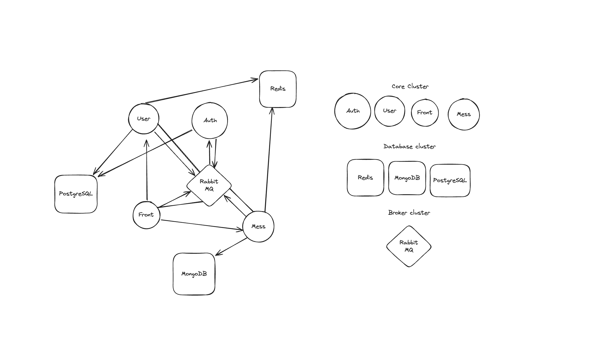

# COHackathon


## Startuping
To run all microservicise you can use kubernetes or up it by yourself:

```
sudo make run-prod // write in every foldey with microserver
```

1. OtherServices
2. Migrations
3. Services

## Kubernetes clusters



- loadbalancers
- Deployment github actions

### Testing
Use tests.sh to test application all application.

### Core
- AuthService
- MessageService
- UserService
- Frontend

### Data layer
- Redis
- PostgreSQL
- Mongo

### Broker
- RabbitMQ

## Envs

2 types:
dev and prod.